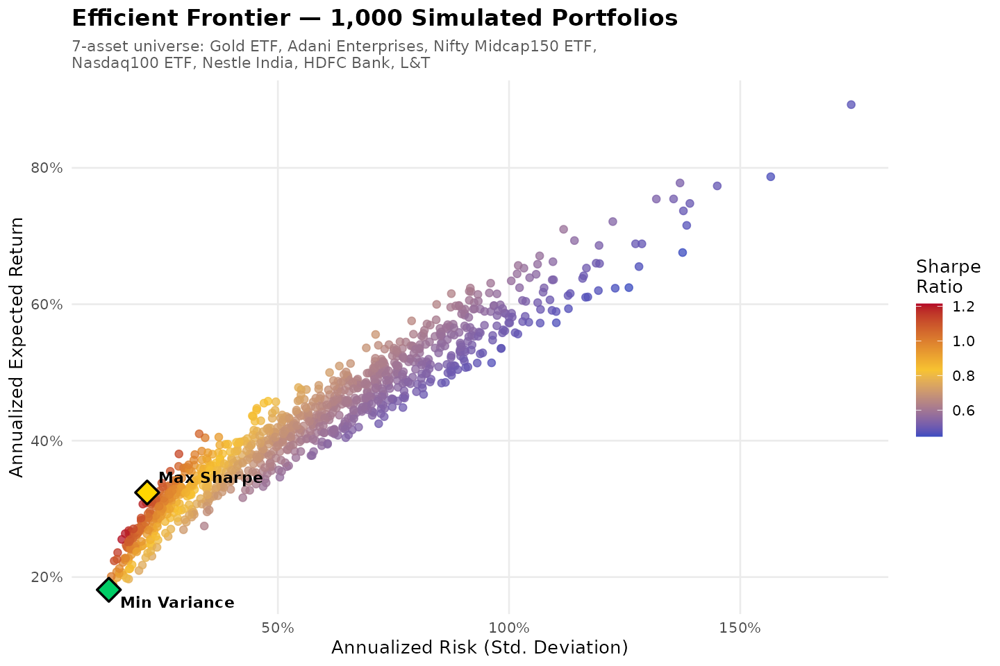

# Portfolio Optimization & The Efficient Frontier

A quantitative finance project that builds a diversified, multi-asset Indian portfolio, simulates thousands of possible allocations, and identifies the ones that sit on the **Efficient Frontier** — maximizing return for a given level of risk.



## Overview

Modern Portfolio Theory (Markowitz, 1952) argues that what matters isn't picking the single "best" stock — it's how assets combine. Two mediocre assets that don't move together can build a portfolio better than either alone. This project puts that idea into code:

1. Pull real daily price history for a 7-asset universe
2. Compute returns, volatility, and the covariance between every pair of assets
3. Simulate 1,000 random portfolios (Monte Carlo) and plot their risk/return profile
4. Identify the **Maximum Sharpe Ratio** portfolio (best risk-adjusted return) and the **Minimum Variance** portfolio (lowest possible risk)

## Asset Universe

Chosen deliberately to span asset classes and sectors — not five stocks that all rise and fall together:

| Ticker | Instrument | Category |
|---|---|---|
| `GOLDBEES.NS` | Nippon Gold ETF | Commodity |
| `ADANIENT.NS` | Adani Enterprises | Conglomerate / Energy |
| `MID150BEES.NS` | Nifty Midcap150 ETF | Diversified Mid-cap Equity |
| `MON100.NS` | Motilal Oswal Nasdaq 100 ETF | US / Global Equity |
| `NESTLEIND.NS` | Nestle India | FMCG |
| `HDFCBANK.NS` | HDFC Bank | Banking / Financial Services |
| `LT.NS` | Larsen & Toubro | Infrastructure / Engineering |

**Data period:** Jan 2020 – Jul 2026 (daily adjusted close, sourced via Yahoo Finance / `quantmod`)

## Methodology

- **Returns:** Daily log returns, annualized by scaling with 252 trading days
- **Risk:** Full 7×7 variance-covariance matrix (annualized), so portfolio risk properly accounts for how assets move together, not just their individual volatility
- **Simulation:** 1,000 randomly weighted, long-only, fully-invested portfolios (weights ≥ 0, sum to 1)
- **Sharpe Ratio:** `(Portfolio Return − Risk-Free Rate) / Portfolio Risk`, with the risk-free rate set at 6% (approximating the Indian 10-year G-Sec yield)

## Results

| Portfolio | Annualized Return | Annualized Risk | Sharpe Ratio |
|---|---|---|---|
| **Maximum Sharpe Ratio** | 32.4% | 21.7% | **1.22** |
| **Minimum Variance** | 18.1% | 13.4% | 0.90 |

**Optimal weights (%):**

| Portfolio | Midcap150 | Adani Ent. | Nasdaq100 | Gold | Nestle | HDFC Bank | L&T |
|---|---|---|---|---|---|---|---|
| Max Sharpe | 33.4 | 35.4 | 22.4 | 0.0 | 5.8 | 1.6 | 1.3 |
| Min Variance | 33.0 | 0.6 | 15.3 | 0.9 | 25.6 | 22.2 | 2.5 |

**Reading the results:** the Max Sharpe portfolio leans into growth assets (mid-caps, Adani, Nasdaq exposure) to chase higher returns, while the Min Variance portfolio rotates into Gold, Nestle, and HDFC Bank — traditionally lower-volatility, defensive holdings — to minimize swings, exactly as portfolio theory predicts.

## Project Structure

```
efficient-frontier-project/
├── README.md
├── data/
│   ├── asset_prices.csv               # Daily adjusted close, 2020–2026
│   ├── daily_returns.csv              # Daily log returns
│   ├── asset_summary_stats.csv        # Per-asset mean & annualized return
│   ├── annual_covariance_matrix.csv   # 7x7 annualized covariance matrix
│   ├── simulated_portfolios.csv       # 1,000 simulated portfolios + weights
│   ├── optimal_portfolio_summary.csv  # Max Sharpe & Min Variance stats
│   └── optimal_portfolio_weights.csv  # Max Sharpe & Min Variance weights
├── scripts/
│   ├── 01_data_collection.R
│   ├── 02_returns_and_covariance.R
│   ├── 03_monte_carlo_simulation.R
│   ├── 04_efficient_frontier_plot.R
│   └── 05_optimal_portfolios.R
└── plots/
    └── efficient_frontier.png
```

## How to Run

```r
# From inside the scripts/ folder, run in order:
source("01_data_collection.R")        # needs internet — pulls fresh prices
source("02_returns_and_covariance.R")
source("03_monte_carlo_simulation.R") # re-simulates; exact numbers will vary slightly (random)
source("04_efficient_frontier_plot.R")
source("05_optimal_portfolios.R")
```

**Requirements:** R ≥ 4.0, packages `quantmod`, `xts`, `zoo`, `ggplot2`, `scales`

> Note: re-running the Monte Carlo simulation draws new random weights each time, so the exact Sharpe ratio and weights will shift slightly from the numbers above. The committed `data/` and `plots/` files reflect the specific run documented in this README.

## Key Takeaways

- Diversification across asset **classes** (not just stocks) meaningfully improves the risk/return trade-off
- The "best" portfolio depends on the investor's objective — maximizing return-per-unit-of-risk (Sharpe) and minimizing absolute risk lead to genuinely different allocations
- A full covariance matrix — not just individual asset volatility — is essential; two assets can each be risky alone but stabilize each other in combination

## Possible Extensions

- Add short-selling and box/group constraints (e.g. cap any single asset at 25%) and compare the resulting frontier
- Backtest the Max Sharpe portfolio out-of-sample against a simple equal-weight benchmark
- Add a Conditional Value-at-Risk (CVaR) objective alongside the Sharpe-based one

---

*Part of a placement portfolio targeting Finance & Investment Analyst roles.*
